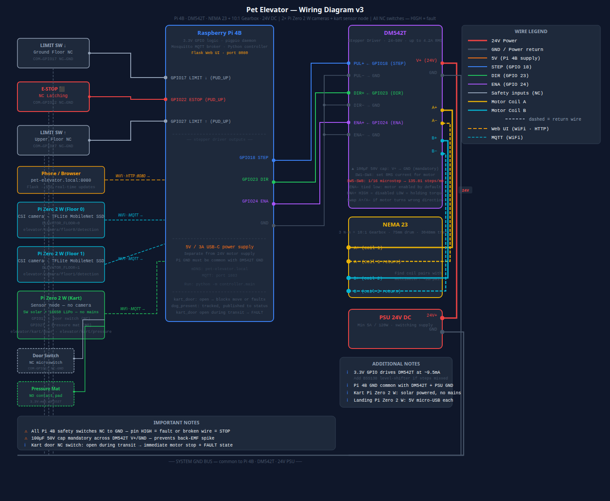

# Pet Elevator

A two-floor cable-winch lift for an ageing dog with mobility difficulties.

A Raspberry Pi 4B drives a NEMA 23 stepper motor via a DM542T driver. Two Pi Zero 2 W camera nodes at each landing detect the dog and call the elevator automatically. A third Pi Zero 2 W on the kart (solar powered) monitors a door switch and pressure mat for boarding confirmation and safety interlocks. Everything is controllable from a browser on the home network.


---

## Hardware

| Component | Part |
|-----------|------|
| Controller | Raspberry Pi 4B |
| Motor | NEMA 23, 3 N·m |
| Driver | DM542T (1/16 microstep, 24 V) |
| Gearbox | 10:1 worm gear (self-locking) |
| Drum | 75 mm diameter |
| Landing cameras | Raspberry Pi Zero 2 W × 2 + CSI camera (one per floor) |
| Kart sensor node | Raspberry Pi Zero 2 W (solar + LiPo, no camera) |
| Kart sensors | NC door switch (GPIO 17) + NO pressure mat (GPIO 27) |
| Safety inputs | 2× NC limit switches, NC latching e-stop, NC door switch |



Full wiring diagram (zoomable SVG): [`wiring/wiring_diagram.svg`](wiring/wiring_diagram.svg)

---

## Quick Start

### Pi 4 — Controller

```bash
# 1. Install dependencies
sudo apt update
sudo apt install -y pigpio python3-pigpio python3-paho-mqtt \
                    python3-pil python3-numpy mosquitto
pip install flask

# 2. Enable services
sudo systemctl enable --now pigpiod mosquitto

# 3. Clone the repo
git clone https://github.com/Thwart-Mallard/pet-elevator /home/pi/pet-elevator
cd /home/pi/pet-elevator

# 4. Install and enable the systemd service
sudo cp deploy/elevator-controller.service /etc/systemd/system/
sudo systemctl daemon-reload
sudo systemctl enable elevator-controller
```

Start the controller (after wiring checks):

```bash
sudo systemctl start elevator-controller
journalctl -u elevator-controller -f
```

Open the web UI on any phone or browser on the home network:

```
http://pet-elevator.local:8080
```

---

### Pi Zero 2 W — Kart Camera Node

```bash
# 1. Enable camera
sudo raspi-config   # Interface Options → Camera → Enable
sudo reboot

# 2. Install dependencies
sudo apt update
sudo apt install -y python3-picamera2 python3-paho-mqtt python3-pil python3-numpy
pip install tflite-runtime

# 3. Download TFLite model
mkdir -p /home/pi/pet-elevator/camera_node/models
cd /tmp
wget https://storage.googleapis.com/download.tensorflow.org/models/tflite/coco_ssd_mobilenet_v1_1.0_quant_2018_06_29.zip
unzip coco_ssd_mobilenet_v1_1.0_quant_2018_06_29.zip \
      detect.tflite labelmap.txt \
      -d /home/pi/pet-elevator/camera_node/models/

# 4. Configure broker address
sudo cp /home/pi/pet-elevator/deploy/elevator-camera.env /etc/default/elevator-camera
sudo nano /etc/default/elevator-camera
# Set ELEVATOR_BROKER=pet-elevator.local

# 5. Install and start the service
sudo cp /home/pi/pet-elevator/deploy/elevator-camera.service /etc/systemd/system/
sudo systemctl daemon-reload
sudo systemctl enable --now elevator-camera
```

---

## MQTT API

All messages are JSON. Broker runs on the Pi 4B (port 1883).

| Topic | Direction | Example payload |
|-------|-----------|-----------------|
| `elevator/command` | → controller | `{"action": "go", "floor": 1}` |
| `elevator/command` | → controller | `{"action": "home"}` |
| `elevator/command` | → controller | `{"action": "estop"}` |
| `elevator/command` | → controller | `{"action": "reset"}` |
| `elevator/status` | ← controller | `{"state": "idle", "floor": 1, "position": 413906}` |
| `elevator/camera/floor0/detection` | ← landing camera | `{"floor": 0, "confidence": 0.91}` |
| `elevator/kart/door` | ← kart sensor | `{"status": "closed"}` |
| `elevator/kart/pressure` | ← kart sensor | `{"dog_present": true}` |

Send a command from any machine on the network:

```bash
mosquitto_pub -h pet-elevator.local -t elevator/command \
  -m '{"action": "go", "floor": 1}'
```

---

## Project Structure

```
pet-elevator/
├── controller/          # Pi 4B — motor, FSM, MQTT, web UI
│   ├── config.py        # GPIO pins, speeds, MQTT settings
│   ├── motor.py         # DMA stepper control (pigpio waves)
│   ├── safety.py        # NC switch callbacks
│   ├── state_machine.py # Elevator FSM
│   ├── mqtt_client.py   # paho-mqtt wrapper
│   ├── web_ui.py        # Flask web UI (port 8080, SSE)
│   ├── templates/
│   │   └── index.html   # Mobile-friendly control interface
│   └── main.py          # Entry point
├── camera_node/         # Pi Zero 2 W ×2 (landing, mains) — TFLite dog detection
├── kart_node/           # Pi Zero 2 W (kart, solar) — door switch + pressure mat
│   ├── config.py
│   ├── detector.py
│   └── main.py
├── deploy/              # systemd service units
├── docs/                # Full documentation
│   ├── 01_project_overview.md
│   ├── 02_hardware.md
│   ├── 03_software_architecture.md
│   └── 04_getting_started.md
└── wiring/
    └── wiring_diagram.svg
```

---

## Documentation

- [Project Overview](docs/01_project_overview.md) — design decisions, physical spec
- [Hardware](docs/02_hardware.md) — BOM, GPIO table, DM542T DIP switch settings
- [Software Architecture](docs/03_software_architecture.md) — module map, state machine, MQTT API, web UI
- [Getting Started](docs/04_getting_started.md) — full installation and first-run guide
